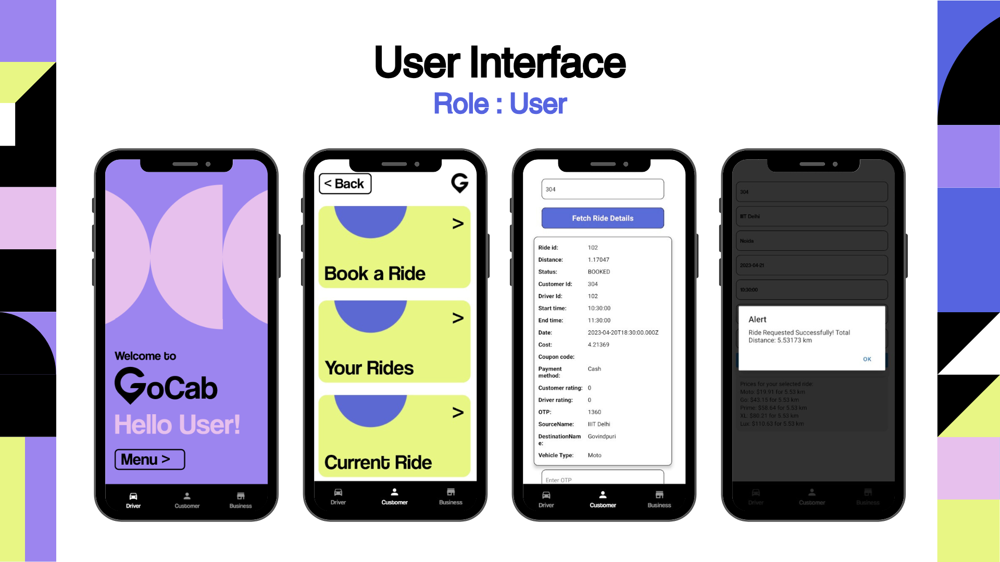
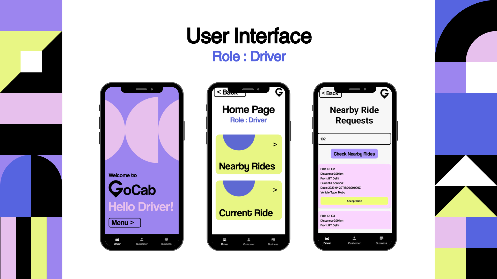

# GoCab

GoCab is a cutting-edge cab service platform designed to cater to drivers, users, and administrators, each with unique functionalities based on company and user requirements.

---

## Contributors

- Anouska Sahoo : [@anouskasahoo](https://github.com/anouskasahoo)
- Kavya : [@Kavya787](https://github.com/Kavya787)

---

## About the Project

GoCab provides a seamless experience for cab services by integrating powerful technologies across both the frontend and backend. The platform supports three distinct user roles:

---
- **Driver**: Manage rides, view account, check current rides' details, etc.
- **User**: Book rides, sign up, check past rides, view drivers, etc.
- **Admin**: Analysis of all past rides, company rewards, revenue analysis, view bookings, etc.

---

## Technology Stack

- **Frontend**:  
  Built with **React Native**, using **Expo** libraries to ensure smooth performance on both **iOS** and **Android** devices.

- **Backend**:  
  Developed in **JavaScript**, creating RESTful API endpoints to manage business logic and data transactions.

- **Database**:  
  Data is stored in a **relational SQL database** hosted securely over the network.

---

## User Interface

---

| Customer Screens | Driver Screens |
|-----------|------------|
|  |  |

---

## Features

- Role-based access with dedicated functionality for each role
- Cross-platform support for Android and iOS
- Real-time operations, including ride booking and tracking
- Scalable backend architecture
- Secure management of user and ride data

---
## Setup and Run Instructions

### Prerequisites

Ensure you have the following installed:
- [Node.js](https://nodejs.org/) (for backend and frontend)
- [Expo CLI](https://docs.expo.dev/get-started/installation/) (for running the React Native app)
- A SQL database (e.g., MySQL, PostgreSQL) for storing data

---

### Steps to Set Up and Run

1. **Clone the repository:**
   ```bash
   git clone https://github.com/anouskasahoo/GoCab.git
   ```

2. Navigate to the project directory:
   ```bash
   cd GoCab
   ```

3. Install frontend dependencies:
   ```bash
    cd Application
    npm install
   ```

4. Install backend dependencies:
   ```bash
    cd ../Backend
    npm install
   ```

5. Set up the database:
   Import the database schema from /Database/schema.sql into your SQL database.

6. Start the backend server:
   ```bash
     node server.js
   ```

7. Start the frontend application:
   In the /Application directory, run:
   ```bash
     expo start
   ```
   This will open a new tab in your browser, and you can use the Expo Go app to scan the QR code to run the app on your phone or open it in a simulator.


---

*Hope you enjoy viewing this project as much as we enjoyed creating it!*

_____ō͡≡o˞̶_____
